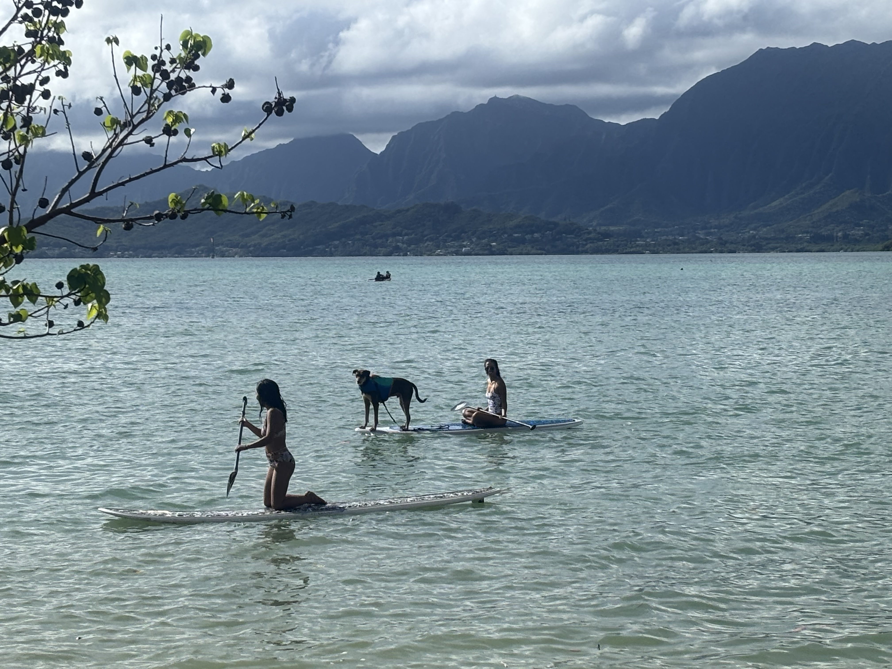

My name in Amy Carrillo. I enjoy mapping and spatially quantifying the coastal and terrestrial world around me. My favorite part is taking an ecological process and distilling it into spatial layers, and then into a map. Reproducibility matters a lot to me, so I do most of my analysis with a mix of R packages and Python libraries. I make sure every spatial layer can be recreated from scratch.

Tid bits:

-   I love skiing.

-   Amateur film photographer.

-   Yogi in training.

-   Caffeine is my reckoning.

If I'm not at my computer, you can find me walking my dog or stand up paddle boarding. And, sometimes both at the same time!?
